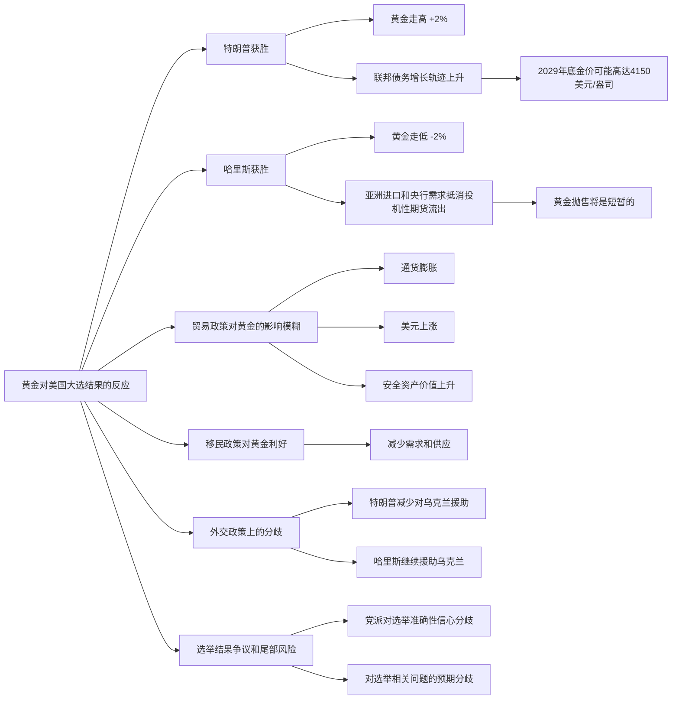

### 20241105
+ 踏空了不要紧，A股总会给机会
    - 今天判断失败之： 3.92、3.94 分两批交出了沪深300etf筹码，结果之后冲到了3.97，手里只剩下区区2k筹码
    - **继续等等**看，这周或许还会有机会入场；但如果没有回撤，**切忌无脑入场**，情愿少赚点也别接盘
    - 机构和游资应该还会有**获利了结**，如果回到T价位再**分批次入场**
    - 1105这波行情可能外资进来的比较多，注意看看是否有**long money**，有的话是长期利好
        * 在US大选还没有确定信息的情况下大涨，有些许可疑，但也可能是**避险**行为
        * 难以相信贵A也成了避险资产？
+ Less is more
    - 港股好一些，近期惫懒不想做T，所以开盘索性挂了一个高位4.688（7266.HK），没想到真的卖出了，平了前段时间的亏损
    - 真的真的，**少tm短线做t**
        * 小震荡市没工夫认真做t，赚的不多
        * 大震荡市做t纯属傻逼，别人赚肉你赚蚊子腿
+ **长期看多黄金**
    - 黄金今日没有操作，等一波大选情况
        * 如果川普上，短期黄金会涨一波，如此应该在川普确定性增加时适当加仓
        * 如果哈里斯，短期应该会下行，这样的话可以再观望一段时间
    - 无论如何，2-3年的中长期看，黄金都是上升趋势，应该逐渐加仓
        * 美元降息是固定预期，市场应该消化得差不多了
        * 未来几年US赤字应该都会上涨，德意志银行11月预测，川普哈里斯两者，无论谁上线都会增加政府赤字（美债down），引起黄金上涨，区别是川普上的反应会更加激烈
        * 德银预测到2029年，黄金基准到`3730`（年增长`6.7%`）；如果是哈里斯：`3940`（年增长`7.9%`）；川普：`4040`（年增长`8.4%`）

